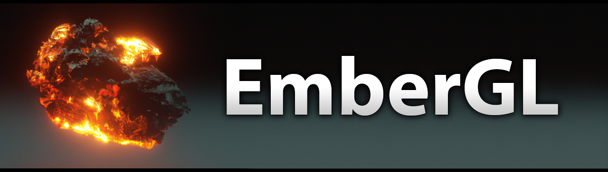

## Overview
EmberGL (Ember Graphics Library) is a low-level open source graphics library, similar to OpenGL/DirectX/Vulkan, designed for real-time 2D/3D rendering on MCUs and other memory constrained non-GPU systems. The graphics API has been specifically designed for such systems, utilizing modern techniques to be able to maximize rendering performance within tight memory budgets, while providing a lot of flexibility and customizability. The library can be also useful on other targets with more generous budgets, for projects which benefit from software rasterization, and can be compiled for example with [Visual Studio](https://visualstudio.microsoft.com/) and [GCC](https://gcc.gnu.org/). Because EmberGL is a low-level library, it provides only the core rendering functionality of flexible and efficient triangle rasterization, along with supporting components and a set of display drivers. These low-level features can be used either for direct application development or development of efficient higher level graphics libraries, such as GUI libraries or 3D engines.

The library features a tile-based software rasterizer, which enables flicker-free rendering without requiring RAM for the entire display frame & depth buffers, thus expands the applicability of the library to a wider set of devices & projects. Tile-Base Rendering (TBR) architectures are commonly used on mobile devices and also on some desktop GPUs mainly due to the memory bandwidth benefits (more info on [Arm Developer website](https://developer.arm.com/documentation/102662/latest)). The TBR engine of EmberGL can be customized for wide range of memory and performance requirements by configuring the rasterizer properties such as the tile size, depth buffer format, intermediate tile pixel format, etc.

EmberGL supports various fixed-function pipeline features, such as a set of depth tests, triangle culling modes, triangle interpolation modes, etc. In addition to the fixed-function features, the library also supports C++ programmable blending and vertex & pixel shading stages for custom geometry and lighting effects. To obtain high performance while supporting a flexible set of features, the rasterizer extensively utilizes C++ templates to generate optimized rasterizers for each set of utilized features during program compilation time. This eliminates any unused feature branching and tightly embeds shader code to the rasterizer, resulting in optimized rasterizers for each used combination of features & shaders.

In addition to the rasterizer, EmberGL provides a growing set of optimized display drivers to efficiently deliver the rasterized pixels to the display. For example, the library contains optimized display driver for popular ILI9341 display with DMA support. The set of drivers can be extended by implementing a narrow device interface, which hooks new drivers to the rasterizer, where the main implementation focus is the device initialization and pixel data transfer without having to worry about the rasterizer complexities.

## Getting Started
The easiest way to get started with EmberGL is to check out [`examples`](examples/). The examples are provided as verbosely commented Arduino `.ino` files, and for anyone not familiar with Arduino, the `.ino` files are just C++ code where `setup()` function is executed once in the beginning of the program and `loop()` function is executing in an infinite loop once per frame. The first example shows how to setup display hardware and initialize the accompanying graphics device, and then proceed with increasing complexity in the further examples. Even though some examples may appear boring, it's good to check them in order, because they progressively explain more concepts that are not necessarily explained again in the latter examples. You can find videos of each example in EmberGL [Examples playlist](https://www.youtube.com/playlist?list=PLZ_pJuzhfjjR8VHPLceESsA72lAbV4BrV) to know what to expect, or click video thumbnails below:

[](https://youtu.be/RFGE5kELUfs) [](https://youtu.be/DNwPy96wWfY) [](https://youtu.be/dvLV1YZV8DA) [](https://youtu.be/PNskpOR5SBQ) [](https://youtu.be/5OtgsO4JMHA) [](https://youtu.be/WdXELRNCcqY) [](https://youtu.be/eHPmojXcEkw) [](https://youtu.be/d9-UDttT1P0) [](https://youtu.be/8bJHSxFcICQ)

## Geometry and Rasterization Pipeline
The EmberGL rasterizer processes the geometry in triangle clusters (a.k.a. meshlets) where each cluster contains some small number of vertices and triangles (e.g. <=64 vertices and <=128 triangles). This is important to optimize both performance and RAM usage of the rasterizer, and to minimize vertex and pixel processing. For 3D geometry, EmberGL supports [P3G file format](https://github.com/JarkkoPFC/meshlete/blob/master/doc/file_format_p3g.xlsx) that can be generated with [Meshlete](https://github.com/JarkkoPFC/meshlete) tool, which splits 3D models in OBJ/FBX/DAE/etc. format to clusters and exports the clustered models as P3G file that can be used with the provided [`p3g_mesh`](src/egl_mesh.h) class. The tool also calculates cluster bounding volumes and visibility cones that are used by the rasterizer to optimize rendering. The P3G format has been designed so that the data can be loaded as a binary blob to memory and requires no post-load processing for rendering. On MCU's this enables storing and rendering the geometry straight from the flash memory without RAM usage, thus enables rendering complex 3D models with a small RAM budget. On other platforms the file can be simply loaded to a dynamically allocated memory block and initialized in place making the loading very efficient.

Objects are dispatched for rasterization using `graphics_device::dispatch_pso()` function (more details about PSCs and PSOs in a chapter below). When the function is called, the object clusters go through a programmable cluster setup stage where they can be culled (e.g. with visibility cones) and then binned to screen tiles (e.g. 64x64px tiles) based on their bounding volumes. Once all the geometry for a frame has been dispatched to the device, calling `graphics_device::commit()` (with an optional tile shader) triggers the rasterization of the tiles. The tiles are rasterized one by one to the tile buffer containing up to 4 render targets, a depth buffer and Hi-Z buffer, and after completing each tile the results are transferred to the display frame buffer. This means that the rasterizer requires render target and depth buffer memory only for a single tile and not for the entire frame buffer. Upon the transfer, the tile pixels are converted from the intermediate tile pixel format to the native display frame buffer format, or alternatively the tile shader is executed to perform custom pixel processing and format conversion. During tile rasterization, the clusters that are binned to the tile are rasterized in the dispatch order and the bounding volume of each cluster is first tested against tile Hi-Z for occlusion. Hi-Z is a low-resolution representation of the depth buffer that can be used for fast region depth test. Clusters that fail the test are rejected and thus skip both vertex transform and rasterization, while the passing clusters go through cluster vertex transform with the associated vertex shader, or previously cached transformed vertices are fetched from the post-transform vertex cache (v-cache). The result of the vertex transform is then potentially stored to v-cache for reuse by other tiles that have the same cluster binned, thus reducing the vertex transform cost. After this the passing cluster triangles go through the rasterization with the associated pixel shader.

The rasterizer complies to top-left rasterization rule to ensure that pixels at the shared edges of adjacent triangles are rasterized exactly once. This is particularly important for proper render target blending (e.g. additive or alpha blending) so the triangle edges don't suffer from pixel overdraw artifacts. Upon triangle rasterization, the rasterized pixels are tested against depth buffer with the selected depth test. Pixels that pass the test execute a programmable pixel shader function which takes the three transformed vertices of the triangle along with barycentric coordinates of the pixel as arguments. The pixel shader can be used to implement custom lighting effects and the barycentric coordinates are used to interpolate post-transform vertex attributes exported from the vertex shader (e.g. texture coordinates or colors). Finally the pixel shader exports the result, potential to Multiple Render Targets (MRT), and the result goes through the programmable blending stage (e.g. opaque, alpha, additive blending).

To minimize vertex and pixel processing with EmberGL it's a good strategy to render opaque objects in increasing distance from the camera, i.e. sort PSOs by camera distance before dispatching. This way clusters are more likely occlusion culled by previously rasterized clusters in the frame and thus eliminate vertex transform and triangle rasterization cost. The pixels of rasterized clusters are also more likely culled by the depth test thus eliminating the pixel processing cost. It's also recommended to apply visibility cone culling during cluster rasterization setup stage, because that will potentially skip the tile binning and the occlusion testing cost for a small culling cost.

## Pipeline State Classes (PSCs) and Objects (PSOs)
Pipeline State Classes (PSCs) are user defined C++ classes which define the render state and operations performed in different stages of the rasterizer (e.g. vertex & pixel shading). These classes are initialized to create Pipeline State Objects (PSOs), which are then setup (e.g. with a mesh and object transformation) and submitted to the graphics device for rasterization with `graphics_device::dispatch_pso()` function. To be compatible with the rasterizer, the PSCs must provide an implementation of the PSC interface defined in [`rasterizer_pcs_base`](src/egl_rasterizer_psc.h). While not mandatory, it's recommended to derive the PSCs from the class to make them more resilient for future EmberGL changes, e.g. if new optional render states or pipeline stages are added to EmberGL, default implementations can be added to [`rasterizer_pcs_base`](src/egl_rasterizer_psc.h) making the derived custom PSCs better compatible with the changes.

Render states define the fixed-function features used for rendering the geometry upon the PSO dispatch, such as depth test or triangle culling mode. The states are defined with enums within the PSC that's used for dispatch. This method of defining the state with compile-time constants enables optimizing rasterizers at compile-time for specific render states, which is important for performance. The available set of render states can be found in [`rasterizer_psc_base`](src/egl_rasterizer_psc.h) definition, which also defines the default render states. By deriving a new PSC from the class the default render states can be overridden simply by redefining the enums in the class:
```cpp
struct my_psc: rasterizer_psc_base
{
  enum {depth_write=false}; // disable depth write and keep the rest of the state as default
  ...
};
```

For convenience, EmberGL provides a generic template PSC [`psc_p3g_mesh`](src/egl_mesh.h) for rendering P3G meshes. This class can be instantiated for given vertex & pixel shaders and vertex input format. It also enables setting the render states via a base class passed as a template argument. The vertex and pixel shaders are implemented as C++ classes with specific interface and both implement `exec()` function which performs the vertex/pixel shading (see [`examples`](examples/) for details).

The shaders can be combined in flexible yet efficient ways for high reuse of the shader code. Vertex shaders can be used with different vertex inputs as long as the data required by the shader is provided by the input. Furthermore, the input data can be provided in different formats transparently to the shaders, e.g. the vertex 3D position data could be uncompressed `vec3f` or quantized to `vec3s` in object bounds and dequantization is done transparently to the vertex shader. The pixel shaders can write to different render target formats and can be combined with any vertex shader that provides post-transform attributes required by the pixel shader.

The shaders can be written so that any post-transform attributes that are unused by pixel shaders are eliminated along with the associated vertex shader code, thus enabling efficient composition of shaders. Unavailable vertex input attributes fetched by vertex shaders return zero values thus enables writing more generic vertex shaders. Also, if the vertex shader doesn't export vertex attributes required by the combined pixel shader, a C++ compilation error occurs informing programmer early about invalid combinations.

## Textures
EmberGL currently supports 2D textures in various texture formats that can be sampled for example during triangle rasterization. Source textures stored as PNG/JPG/TGA/DDS/etc. file format can be converted to [PTX format](https://github.com/JarkkoPFC/ptx_converter/blob/main/doc/file_format_ptx.xlsx) with [PTX Texture Converter](https://github.com/JarkkoPFC/ptx_converter) tool, which can be used with [`texture`](src/egl_texture.h) class. Like the P3G format, the PTX format has been designed so that the data can be loaded as a binary blob to memory and requires no post-load processing for sampling, which on MCU's enables storing and sampling textures straight from the flash memory saving RAM.

Once [`texture`](src/egl_texture.h) has been initialized with the PTX data, it can be sampled using an appropriate sampler class for the texture type (e.g. [`sampler2d`](src/egl_texture.h) for 2D textures). The sampler fetches texture data at the requested texture coordinates and provides the data in the requested pixel format. The sampling can be done either with point or bilinear sampling and samplers support wrap and clamp-to-edge texture address modes.

## Math Library
EmberGL comes with a comprehensive C++ template math library that provides various math components relevant for 2D and 3D rendering (e.g. matrix/vector/quaternion classes). These components are used throughout EmberGL and are also useful in client code to perform the necessary math operations which seamlessly interface with the library.

- [`egl_math.h`](src/egl_math.h): Linear algebra classes: 2D, 3D and 4D vector and matrix classes, quaternion and complex number classes with large set of operations that can be performed on them (matrix multiplication, dot/cross products, etc.etc.)
- [`egl_tform3.h`](src/egl_tform3.h): 3D transformation and camera classes along with many operations for them.
- [`egl_color.h`](src/egl_color.h): RGB, XYZ, YIQ and HSV color classes, operations and transformations.
- [`egl_fast_math.h`](src/egl_fast_math.h): Fast approximations for some math operations (e.g. `1.0f/sqrt(x)`). Can be useful where performance is more important than accuracy.

## Development
EmberGL has three predefined build configurations to control the level of program validation: Debug, Release and Retail. These builds can be respectively selected in [`egl_core.h`](src/egl_core.h) by uncommenting one of the defines: `EGL_DEBUG`, `EGL_RELEASE` or `EGL_RETAIL`. Debug build has all programming run-time validation enabled and is the most verbose of the builds. It's recommended to use the Debug build during development to catch programming errors with the most information during program execution, if the performance and memory usage isn't an issue. Release build is a compromise between the validation, performance and memory usage, which can be used for builds deployed during development (e.g. internally for testing). All but the most performance intensive validation are enabled in Release, but for example the C++ source file and line number information is omitted from errors for reduced memory footprint. Retail build has all the programming validation disabled and is the best performing build with the smallest memory footprint, and should be used for the final shipping product to users. The level of validation and logging can be tweaked in [`egl_core.h`](src/egl_core.h) for these predefined builds if necessary and new build configurations can be added with different configuration because none of the EmberGL code checks for the selected build directly. In the beginning of the program `init_serial()` must be called which enables run-time logging to the serial monitor.

There are several macros provided with the library, that can be used to check for programming errors within EmberGL (e.g. invalid parameters passed to a function) and can be also used in client code. Note that these macros shouldn't be used for validating user errors, because they are disabled in the Retail builds delivered to users, and because they terminate the program execution, which shows as a crash to users. If the validation fails, the macros output a message to the log and terminates the program execution, and trigger debugger if attached. Below is the list of provided macros with their intended use, but for use-case references it's the best to check EmberGL code:
- `EGL_ASSERT()`: Validates that given expression is true, and upon error outputs the failed expression to the log and terminates the program.
- `EGL_ASSERT_MSG()`: Validates the expression, and upon error outputs the given formatted message to the log and terminates the program.
- `EGL_ASSERT_PEDANTIC()`: The same as `EGL_ASSERT()` but is used only in performance critical code where the validation adds relatively large overhead. Pedantic asserts can be disabled with the build configuration separate from non-pedantic asserts to improve performance (these are disabled in Release build).
- `EGL_ASSERT_PEDANTIC_MSG()`: The same as `EGL_ASSERT_PEDANTIC()` but with the formatted message.
- `EGL_ERROR()`: Outputs the given formatted error message to the log and terminates the program execution.
- `EGL_ERROR_NOT_IMPL()`: Special error message for functionality that hasn't been implemented and terminates the program execution.
- `EGL_WARN()`: Outputs the given formatted warning message to the log but doesn't terminate the program execution.
- `EGL_LOGF()`: Outputs given formatted message to the log. These logs are supposed to ship with the final Retail build.
- `EGL_LOG()`: The same as `EGL_LOGF()` but with unformatted message. This is more efficient than `EGL_LOGF()` and should be used when no formatting is required.
- `EGL_DEBUG_LOGF()` and `EGL_DEBUG_LOG()`: The same as `EGL_LOGF()` and `EGL_LOG()` respectively, but used for development logging and are not included in the final shipping builds.

Developing more complex applications and libraries directly on MCUs (e.g. with the Arduino IDE) can be challenging due to the constrained system and the lack of development tools, such as a good debugger. Because of the portability of EmberGL, most of the development can be done for example on PC, and once the application runs as expected then compiled for MCUs. Naturally some code is MCU specific (e.g. display drivers or interfacing with the MCU hardware), but structuring the code to portable and MCU specific parts can significantly help with the development.

## TODO
Some planned further improvements (excluding issues) of the library:
- [ ] [Near plane triangle clipping & culling](https://github.com/EmberGL-org/EmberGL/issues/1) ***[S5]***
- [ ] [2D texture mipmap support](https://github.com/EmberGL-org/EmberGL/issues/2) ***[S2]***
- [ ] [Cubemap support](https://github.com/EmberGL-org/EmberGL/issues/3) ***[S2]***
- [ ] [Support to control HiZ update frequency](https://github.com/EmberGL-org/EmberGL/issues/4) ***[S1]***
- [ ] [Depth-only rendering](https://github.com/EmberGL-org/EmberGL/issues/5) ***[S0]***
- [ ] [Refined cluster occlusion & tile culling with PTV](https://github.com/EmberGL-org/EmberGL/issues/6) ***[S1]***
- [ ] [Example: Shadow mapping](https://github.com/EmberGL-org/EmberGL/issues/7) ***[S2]***
- [ ] [Example: Deferred shading](https://github.com/EmberGL-org/EmberGL/issues/8) ***[S3]***

## License
EmberGL is licensed under MIT license. See [LICENSE](LICENSE) for details.
